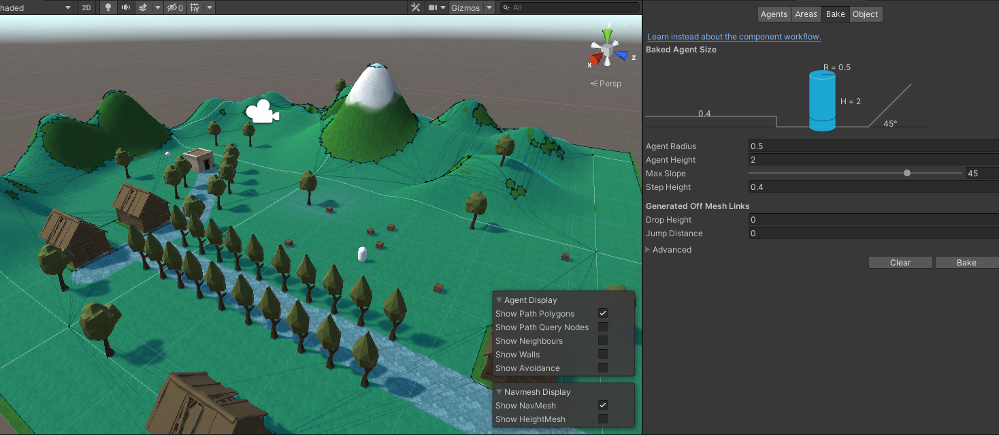
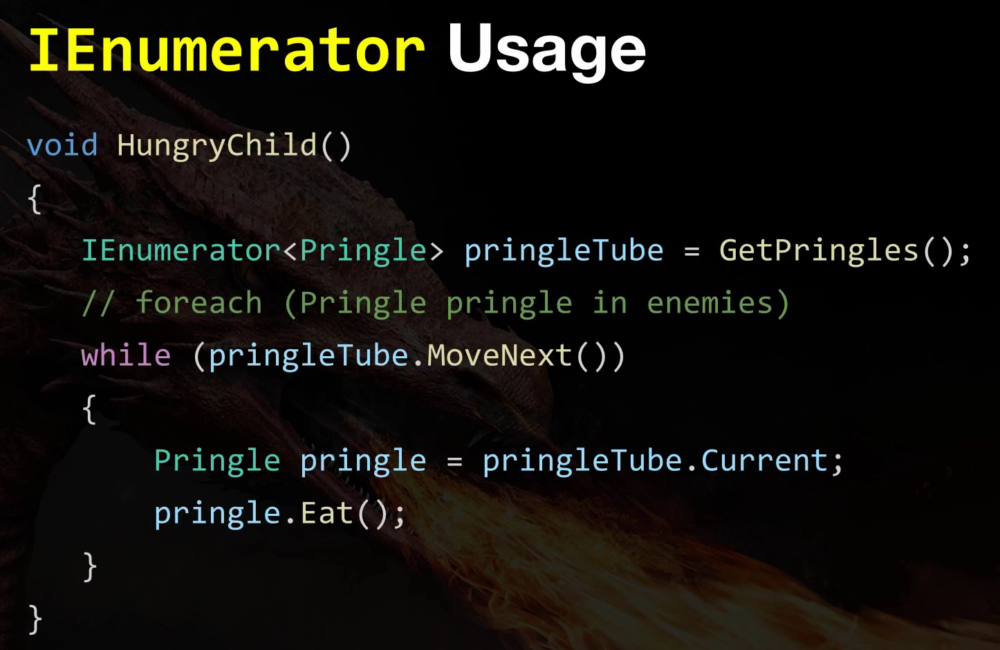

<div align="center">
  <h1>2019 RPG Core Combat Creator: Learn Intermediate Unity C# Coding</h1>
</div>

<div align="center"> 
  
</div>

**Table of contents**

- [Keywords](#keywords)
  - [Ternary Operation](#ternary-operation)
- [Introduction](#introduction)
- [Basic Movement](#basic-movement)
  - [Move using Nav Mesh Agent](#move-using-nav-mesh-agent)
  - [Refining your Nav Mesh](#refining-your-nav-mesh)
  - [Introduction to Raycasting](#introduction-to-raycasting)
  - [Implement Click-To-Move](#implement-click-to-move)
  - [Create a Fixed Follow Camera](#create-a-fixed-follow-camera)
  - [Animation Blend Trees](#animation-blend-trees)
  - [Match Animation To Movement](#match-animation-to-movement)
  - [Basic Movement Tweaks](#basic-movement-tweaks)
  - [Project Folder Structure](#project-folder-structure)
- [High Level Game Design](#high-level-game-design)
  - [1.5 Page Game Design Document](#15-page-game-design-document)
  - [The player experience](#the-player-experience)
  - [First draft of your GDD](#first-draft-of-your-gdd)
- [Basic Combat](#basic-combat)
  - [Separating the control layer](#separating-the-control-layer)
  - [Namespaces to see dependencies](#namespaces-to-see-dependencies)
  - [Raycasting For Components](#raycasting-for-components)
  - [Implementing Action Priority](#implementing-action-priority)
  - [Move within range and Canceling Combat with movement](#move-within-range-and-canceling-combat-with-movement)
  - [Decoupling dependencies cycles](#decoupling-dependencies-cycles)
  - [Dependency Inversion With Interfaces](#dependency-inversion-with-interfaces)
  - [Add Attack Animation](#add-attack-animation)
  - [Taking Damage](#taking-damage)
  - [Nested prefabs and variants](#nested-prefabs-and-variants)
  - [Stop attacking already](#stop-attacking-already)
  - [Look at the in the eyes](#look-at-the-in-the-eyes)
  - [Bugs, What bugs?](#bugs-what-bugs)
- [Enemy AI](#enemy-ai)
  - [Swappable Control Systems](#swappable-control-systems)
  - [Disable Control When Dead](#disable-control-when-dead)
  - [Visualising with gizmos](#visualising-with-gizmos)
  - [That's some suspicious behaviour](#thats-some-suspicious-behaviour)
  - [Visualising Waypoints](#visualising-waypoints)
- [First Moment](#first-moment)
  - [Design a moment](#design-a-moment)
  - [Hits to kill Design metric](#hits-to-kill-design-metric)
  - [Cinemachine Follow Camera](#cinemachine-follow-camera)
  - [The observer pattern](#the-observer-pattern)
- [Scene Management](#scene-management)
  - [How coroutines work?](#how-coroutines-work)
  - [Nested coroutines for fading](#nested-coroutines-for-fading)
  - [Avoiding singleton pattern](#avoiding-singleton-pattern)
- [Saving Asset Pack](#saving-asset-pack)
  - [The saving system overview](#the-saving-system-overview)
  - [Triggering saving and loading](#triggering-saving-and-loading)
  - [Saveable components and gameobjects](#saveable-components-and-gameobjects)
  - [Load Last Scene](#load-last-scene)
  - [Capturing multiple parameters](#capturing-multiple-parameters)
  - [Bonus runtime objects](#bonus-runtime-objects)
- [Saving System](#saving-system)
- [Simple Weapons](#simple-weapons)
  - [Animator override controller](#animator-override-controller)
  - [Damage from projectile](#damage-from-projectile)
  - [Dynamic Resource Loading](#dynamic-resource-loading)
  - [Pickup Respawning](#pickup-respawning)
- [Character Stats](#character-stats)
  - [Prograssion Design](#prograssion-design)
  - [Progression scriptable object](#progression-scriptable-object)
  - [Awarding experience points](#awarding-experience-points)
  - [Editing Scriptable Object Files](#editing-scriptable-object-files)
  - [Delegate Observer Pattern](#delegate-observer-pattern)
  - [Data Hazards and race conditions](#data-hazards-and-race-conditions)
- [Saving System](#saving-system-1)
  - [Overview to binary serialization](#overview-to-binary-serialization)
  - [Understanding Unicode](#understanding-unicode)
- [Final Polish](#final-polish)

# Keywords

This website shows how to animate chatacters from Synty Studios.

https://www.youtube.com/watch?v=9H0aJhKSlEQ

Find all the animations here: 

https://www.mixamo.com/#/

## Ternary Operation

``cs
in_direction = Input.GetAxis("Horizontal") <0 ?-1:1;

is the same as 
if (Input.GetAxis("Horizontal") <0)
  in_direction =  -1;                  
else
  in_direction =  1;   

or

if Input.GetAxis("Horizontal")<0 then in_direction = -1 else in_direction = 1
``

# Introduction

This documents is the reference for the course RPC Core Combar Creator.

cd /mnt/d/GameDevelopment/Unity3D/0GameDev/ARPGUnity3D/ARPGUnity3D/

cd /d/GameDevelopment/Unity3D/0GameDev/ARPGUnity3D/ARPGUnity


**Course 1:**


**Course 2:**


**Course 3:**


**Course 4:**


# Basic Movement


## Move using Nav Mesh Agent

Note: if you select the camera, then game object, align with view, the camera shows excatly what you were seeing in you scene, is AWESOME!.


Use bake to create the navmesh



## Refining your Nav Mesh


Agent radius: The distance that the object can get to the obstacles.


If an object is static, it means is never going to move, so the navigation detects it and don't allow the Nav mesh to go through.


If you increase the min region area, it doesn't bake the mesh in small areas such as the roofs or the top of a mountain.


You can add navmesh obstacle to an object, and then the object can even move, and the mesh will update to the position of the object, this is if you have selected Carve.

## Introduction to Raycasting

What is Raycasting?

Is the process of shooting an invisible ray from a point, in a specified direction to detect whether any colliders lay in the path of the ray.


We're going to use:

- Camera.ScreenPointToRay https://docs.unity3d.com/ScriptReference/Camera.ScreenPointToRay.html
- Debug.DrawRay https://docs.unity3d.com/ScriptReference/Debug.DrawRay.html

```cs
Debug.DrawRay(lastRay.origin, lastRay.direction * 100, Color.red);
```

```cs
if (Input.GetMouseButtonDown(0))
{
    lastRay = Camera.main.ScreenPointToRay(Input.mousePosition);
}
Debug.DrawRay(lastRay.origin, lastRay.direction * 100, Color.red);
playerNavMeshAgent.destination = target.transform.position;
```

## Implement Click-To-Move


- RayCastHit https://docs.unity3d.com/ScriptReference/RaycastHit.html
- Physics.Raycast https://docs.unity3d.com/ScriptReference/Physics.Raycast.html

```cs
Physics.Raycast(ray, out hitInformation);
```
The word out even though it is an input, it is actually creating an output. how interesting.

```cs
    private void MoveToCursor()
    {
        if (Input.GetMouseButtonDown(0))
        {
            Ray ray = Camera.main.ScreenPointToRay(Input.mousePosition);
            RaycastHit hitInformation;
            bool hasHit = Physics.Raycast(ray, out hitInformation);
            if (hasHit)
            {
                playerNavMeshAgent.destination = hitInformation.point;
            }
        }
    }
```

## Create a Fixed Follow Camera


## Animation Blend Trees

Synty Studios They are awesome!

https://assetstore.unity.com/publishers/5217

- **Animator Component:** Assigns animations to GameObjects through an Animator Controller
- **Animator Controller:** Arrangement of animations and transitions (State machine).
- **Animation:** Specific pieces of motion
- **Blend Tree:** Allows multiple animations to be blended together smoothly

## Match Animation To Movement

- **Velocity:** Rate of change of position over time
  - That is speed and direction
- The nav mesh agent is thinking in terms of Velocity - Direction to move and speed to travel there.
- Our character's locomotion animations are only interested in forward speed (along the Z axis)

- Transform.InverseTransformDirection https://docs.unity3d.com/ScriptReference/Transform.InverseTransformDirection.html

The transform.InverseTransformDirection is used because the Vector3 velocity = GetComponent<NavMeshAgent>().velocity; gives the speed in x, y and z coordinates in a global reference, so you could end up with a speed such as (5.7, 0, 0), but this is speed in the local reference is actually (0, 0, 5.7) because the player is moving in the Z axis locally.

## Basic Movement Tweaks

https://docs.unity3d.com/Manual/ExecutionOrder.html


## Project Folder Structure


# High Level Game Design

This section is about Game Design!

## 1.5 Page Game Design Document


## The player experience


The most important high level design is:

To create a very specific and consistent player experience that you the have every aspect fo your game support.

3 Ways to express player experience:
1. To make the player feel "Like a particular type of person"

<br>
For example skyrim makes the player feel like and adventurous.

2. Make the player feel a certain emotion

<br>
For example god of war, they want the player to feel powerful.

3. Give the player the same feeling as "doing a certain activity"

<br>
For example minecraft, feels like playing with lego.

The best games create a consistent experience in every aspect of the game in regards to:
- Art
- Gameplay
- Audio
- Story
- Marketing

If in doubt, do whatever will create the experience you are aiming for.

## First draft of your GDD

When you are making a game you have to start making it get into unity, start prototiping things because that's when the ideas will come to you when you are seeing your game come to life.

Don't start thinking about the story because you might end up stuck in there and never make the game.

# Basic Combat

Feature list

- Click to attack
- Animations
- Repeat attacking
- Damage dealing
- Death

## Separating the control layer

<br>

## Namespaces to see dependencies

Dependencies are evil.

<br>

Cycles are worse!

<br>

If you change something in movement and you break it, this could happen.

<br>

You can arrange things in layer where none of the modules reference to something higher up.

<br>

<br>

The lower layers are the ones that are not going to change much, but the higher layers are the ones that change a lot.

The lower have lots of dependencies, but the higher ones have a few or none dependencies.

Within a namespace you want things to be as cohesive as possible, what that means is try as much as possible to be related to one another so they will have to use each other clases.

An example of not cohesion.

<br>

An example of cohesion would be:

<br>

My dependencies right now would look like this:

<br>

## Raycasting For Components

- RaycastAll https://docs.unity3d.com/ScriptReference/Physics.RaycastAll.html

It's a ray that passes through targets and returns an array of all the things that were hit.

## Implementing Action Priority

```cs
void Update()
{
    if (InteractWithCombat()) return;
    if (InteractWithMovement()) return;
}

private bool InteractWithCombat()
{
    RaycastHit[] hits = Physics.RaycastAll(GetMouseRay());
    foreach (RaycastHit hit in hits)
    {
        CombatTarget target = hit.transform.GetComponent<CombatTarget>();
        if (target == null) continue;

        if (Input.GetMouseButtonDown(0))
        {
            GetComponent<Fighter>().Attack(target);
        }
        return true;
    }
    return false;
}

private bool InteractWithMovement()
{
    RaycastHit hitInformation;
    bool hasHit = Physics.Raycast(GetMouseRay(), out hitInformation);
    if (hasHit)
    {
        if (Input.GetMouseButton(0))
        {
            GetComponent<Mover>().MoveTo(hitInformation.point);
        }
        return true;
    }
    else
    {
        return false;
    }
}
```

What we are going to make with this, is that the cursor will change if you can attack a target, or if you can walk somewhere. Also if you can attack a target, the Fighter.attack will be excecuted not the movement.

## Move within range and Canceling Combat with movement

Short citcuit operators

<br>

<br>

This also works with OR, so basically if the first statement is not true then the second statement is checked.

## Decoupling dependencies cycles

This is what we got:

<br>

This is what we will do.

<br>

**Substitution Principle:**

When you inherit from something in object oriented programing, you have to behave excatly like that thing.

For example, if all these things derive from missile, then they must be able to be pointed to the direction and launch.

<br>

The substitution principle says, if I have a function that takes it a missile as its arguments, what I should be able to do is to give it a bullet, or an arrow or a rocket. And it won't know that is an arrow, bullet or rocket but it can treat it like a missile and It will just do its job.

So in our example monobehaviour can be passed a mover or a fighter.

<br>

## Dependency Inversion With Interfaces

We have ta problem and is that if we do within ActionScheduler If mover do something and If fighter do something else, we would be creating cycles again.

<br>

To solve this:

<br>

- Everything in an interface is public
- You can't have any bodys, implementation, variables
- It can only be methods and properties.
- You can't inherit from more than one class, but you can inherit for as many interfaces as you like.

```cs
    public class Mover : MonoBehaviour, IAction
    {
        public void StartMoveAction(Vector3 destination)
        {
            GetComponent<ActionScheduler>().StartAction(this);
            GetComponent<Fighter>().CancelAttack();
            MoveTo(destination);
        }

        public void Cancel()
        {

        }
    }
}
```
This makes this:

<br>

If we did it with a fighter it would call the same cancel but in the fighter instead.

<br>

## Add Attack Animation

Free pack - https://assetstore.unity.com/packages/3d/animations/rpg-character-mecanim-animation-pack-free-65284

## Taking Damage

The component pattern:<br>
http://gameprogrammingpatterns.com/component.html

The idea is that we should keep as separate things among components.

```cs
health = Mathf.Max(health - damage, 0);
```
This gets me if the health - damage is less than zero, the the health becomes zero. Very clever.

## Nested prefabs and variants

Player and enemies at the end are very similar except to the controller script. That is why we do prefab variants.

A prefab is a collection of game objects, with components and properties

<br>

<br>

Nested Prefabs

<br>

Variant

<br>

<br>

## Stop attacking already

```cs
namespace RPG.Combat
{
    [RequireComponent(typeof(Health))]
    public class CombatTarget : MonoBehaviour
    {

    }
}
```
This makes mandatory to have a Health script if CombatTarget is present. If you try to remove it it does not allow it, if you add a new component and add CombatTarget it automatically adds Health as well.

## Look at the in the eyes

How to know when to move one?

- In early development, don't get stuck on one feature.
- Move on to the next thing when you can pass this test:
  - Is there anything about this feature which is distracting or broken?

<br>

We solve the look in the eyes with.

Transform.LookAt - https://docs.unity3d.com/ScriptReference/Transform.LookAt.html

## Bugs, What bugs?
When to fix different types of bugs?
- Game breaking-stops de game from working
  - Drop everything and fix immediately
- Annoying - Player will be distracted
  - Fix it before moving on to next feature
- Looks bad - player will notice
  - Fix it when you have time
- Could be improved - player may or may not know
  - Not a bug, add it to your polish list for end of the project.

How to fix a bug
- Follow the repro steps with our bug to see if you can indentify what is causing the bug

# Enemy AI

- Chase radius
- Aggresive behavior
- Gizmos
- Suspicion: When I leave his chase radius he is going to go to the last known location and then back to patrol
- Guarding: They have posts to stand and guard
- Patrol Routes: They follow routes all the time and stop in nodes.

## Swappable Control Systems

<br>

## Disable Control When Dead

<br>

## Visualising with gizmos

```cs
// Called by Unity
private void OnDrawGizmosSelected()
{
    Gizmos.color = Color.blue;
    Gizmos.DrawWireSphere(transform.position, chaseDistance / 2);
}
```

## That's some suspicious behaviour

Finite State machine<br>
<br>

## Visualising Waypoints

<br>

# First Moment

## Design a moment

<br>

<br>

The important thing about moments is that they have to be different.

Design your moment:

1. One sentence overview of the moment?
The player is ready to challenge the world beyond the unknown.

2. Where is the moment taking place?
Abandoned town

3. What is the player trying to do?
Explore the gameplay mechanics, as well as killing the enemies on his path.

4. What is one meaningful choice you can give the player?
Attack all enemies all at once or lure them individually.

## Hits to kill Design metric

<br>
<br>
<br>
<br>
<br>

## Cinemachine Follow Camera

https://docs.unity3d.com/Packages/com.unity.cinemachine@2.2/manual/CinemachineImpulse.html

<br>

<br>

## The observer pattern

<br>

# Scene Management

## How coroutines work?

<br>

<br>

<br>

<br>

<br>

Coroutine Recap

<br>

<br>

Note: DontDestroyOnLoad only works when your gameobject is a the root of the scene, It cannot be under any other gameobjects.

## Nested coroutines for fading

<br>

## Avoiding singleton pattern

A normal variable usually lives and dies with the class, a static variable it lives and dies in the application.

# Saving Asset Pack

## The saving system overview

<br>

<br>

<br>

## Triggering saving and loading

<br>

Files are saved here.

C:/Users/juans/AppData/LocalLow/DefaultCompany/RPG Project\save.sav

## Saveable components and gameobjects

<br>

## Load Last Scene

<br>

## Capturing multiple parameters

Method 1:
```cs
public object CaptureState()
{
    Dictionary<string, object> data = new Dictionary<string, object>();
    data["position"] = new SerializableVector3(transform.position);
    data["rotation"] = new SerializableVector3(transform.eulerAngles);
    data["rPressed"] = rPressed;
    return data;
}

public void RestoreState(object state)
{
    Dictionary<string, object> data = (Dictionary<string, object>)state;
    GetComponent<NavMeshAgent>().enabled = false;
    transform.position = ((SerializableVector3)data["position"]).ToVector();
    transform.eulerAngles = ((SerializableVector3)data["rotation"]).ToVector();
    GetComponent<NavMeshAgent>().enabled = true;
    rPressed = (bool)data["rPressed"];
}
```

## Bonus runtime objects

Are you trying to spawn objects at run-time and wondering how this would fit into our system? If not then you can safely leave this article for another time. Otherwise, read on...

As you might have seen UUIDs are generated at edit time. GameObjects spawned in the scene at runtime do not get tracked by the save system nor does it try to respawn objects on load. There are two ways to solve this.

We will evaluate the two using the example of weapon drops spawned by enemies when they die. We will assume that you want to keep weapons in the same place between saves.

Run-time Object Manager
In this approach, you would have a manager object in every scene responsible for saving and loading all the pickups.

On save, the manager would find all the pickup game objects, query the important state, save this to an array and return that.

On restore, the manager would iterate through the array and spawn all the game objects.

Optionally, this manager could be responsible for spawning the objects in the first place given that it already knows how to do that.

Make the Spawner Responsible
Alternatively, you can put the responsibility in the hands of the object that spawned the run-time object. In our example, this would be the enemy. When the enemy dies, it records a list of the GameObjects it spawned.

When saving it would query the scene for these objects. Check if they have already been picked up (in which case we can remove them from the list) and store their state to an array.

When restoring we would respawning the objects from the same array.

Hopefully, one of these two approaches works for you and helps you keep track of run-time spawned objects.

# Saving System

Skipped

# Simple Weapons

## Animator override controller

https://docs.unity3d.com/ScriptReference/AnimatorOverrideController.html

## Damage from projectile

<br>

## Dynamic Resource Loading

You can put folders called Resources anywhere in your project and access them within the script. Remember that the name of files cannot be duplicated or it won't work. Attacks/Unarmed if you had more folders in your Resources

<br>

As a general rule of thumb, it’s best to cache references to components that are on the same GameObject in Awake() instead of Start().

## Pickup Respawning

How to show all childs of an object:

```cs
foreach (Transform child in transform)
{
    child.gameObject.SetActive(shouldShow);
}

This loops within all the childs.
```

# Character Stats

## Prograssion Design

<br>

The progression is actually a spreadsheet, but the way we imported is done in the next course.

<br>

<br>

## Progression scriptable object

```cs
[CreateAssetMenu(fileName = "Progression", menuName = "Stats/New Progression", order = 0)]
public class Progression : ScriptableObject
{
    [SerializeField] ProgressionCharacterClass characterClass;
    
    [System.Serializable]
    class ProgressionCharacterClass
    {
        [SerializeField] int value = 3;
        [SerializeField] string name = "Hello";
    }
}
```
<br>

## Awarding experience points

<br>

## Editing Scriptable Object Files

<br>

## Delegate Observer Pattern

<br>

Have the dependency go in one direction but execution to go in the other direction.

**Delegate** list of pointers to methods.

**Event** a protection on top of a delegate to prevent overwriting.

**Action** a predefined delegate with no return value., it is included in using System;

<br>

```cs
//public delegate void ExperienceGainedDelegate();
public event Action onExperienceGained; //Action is the same as the last line
```

Experience.cs
```cs
using System.Collections;
using System.Collections.Generic;
using UnityEngine;
using RPG.Saving;
using System;

namespace RPG.Stats
{
    public class Experience : MonoBehaviour, ISaveable
    {
        // Config
        [SerializeField] float experiencePoints = 0;

        public event Action onExperienceGained;

        public void GainExperience(float experience)
        {
            experiencePoints += experience;
            //onExperienceGained();
        }

        public float GetExperiencePoints()
        {
            return experiencePoints;
        }

        public object CaptureState()
        {
            return experiencePoints;
        }

        public void RestoreState(object state)
        {
            experiencePoints = (float)state;
        }
    }
} 
```

## Data Hazards and race conditions

Guidelines
- Don't call methods in Awake,
  - Monobehaviours and scriptableobjects
- We use awake to setting up ourseles with data that we already have
- All state should be safe to access by start
  - Check all uses of variables that are initialized in start

# Saving System

## Overview to binary serialization

Is the process of taking important data that you have in your game and turning it into binary. Once is binary we can so many things with it.

<br>

<br>

<br>

## Understanding Unicode

https://docs.microsoft.com/en-us/dotnet/api/system.io.filemode?view=netframework-4.7.2


# Final Polish